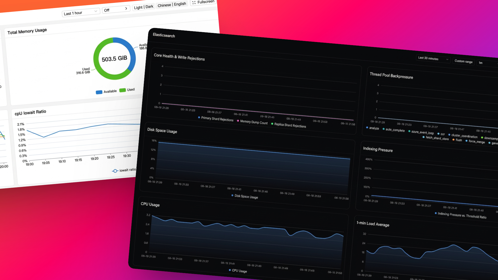

# signoz-open-dashboard

Turn SigNoz into a universal embedded business dashboard — drop any live dashboard into your product, portal, or big screen with a single iframe.

```html
<iframe
  src="https://embed.example.com/embed/<dashboardId>?apiKey=<key>&relativeTime=30m&theme=shadcn&mode=light"
  style="width:100%;border:0"
  allowfullscreen>
</iframe>
```



Your metrics already live in SigNoz. Your users — customers checking service health, ops watching a NOC wall, teammates reading a weekly report — don't. This project bridges that gap: it serves every SigNoz dashboard as a **portable, read-only, live widget** that renders anywhere an iframe can go. No login page, no SigNoz account for viewers, no frontend to build — just a URL.

> [!NOTE]
> The canonical spec is `docs/product-tech-design.md`. If this README ever disagrees with it, the design doc wins.

## Why embed

- **Customer-facing status & SLA pages** — show live health, latency, and usage on your support portal without giving customers console access.
- **In-product analytics** — put real operational charts inside your admin panel, SaaS settings page, or partner portal.
- **Ops & NOC walls** — kiosk-ready chrome toggles (`title`/`toolbar`/`fullscreen`) turn any dashboard into a big-screen view.
- **Reports & reviews** — time, variables, and refresh all live in the URL, so every shared link reproduces the exact same view.

## What you get

- **One-line embed**: `GET /embed/:dashboardId?...` renders toolbar + dashboard grid. Callers just build the URL.
- **Always live, never stale**: data streams from your SigNoz backend on every load and refresh interval — no exports, no screenshots, no scheduled sync jobs.
- **Read-only by design**: no edit/clone/delete/settings/lock/alerts UI; dashboard writes and all non-allowlisted APIs return `403`. Safe to put in front of strangers.
- **Key flexibility**: effective key = `x-embed-api-key` header (from the URL `apiKey`, kept in memory only) `?? env.SIGNOZ_API_KEY`. A missing key renders a friendly `401` empty state, never a stack trace.
- **URL-driven view**: time, theme, color mode, locale, refresh, variables, toolbar/title/fullscreen all come from query params and sync back via `history.replaceState` — every view is a shareable link.
- **Two themes**: `shadcn` (default, tailwind + Recharts) and `legacy` (antd + echarts), switched with `?theme=`. Unknown values fall back to `shadcn`.
- **Public iframe**: `CSP frame-ancestors *` and `CORS *` are intentional — anyone with the link can view.
- **Observable**: `GET /healthz`, `GET /metrics` (prom-client), JSON logs that record only the key source and an 8-char key hash, never the plaintext key.

## Prerequisites

- Node `>=20`, `pnpm@9`.
- A running SigNoz `v0.97.0` backend and an API key with dashboard view permission.

## Quick start

```bash
pnpm install

# dev (run both; web on :5173 proxies /api/signoz to :8080):
SIGNOZ_BASE_URL=http://<signoz-host>:30303 SIGNOZ_API_KEY=<key> pnpm dev:api
pnpm dev:web
```

Production:

```bash
pnpm build   # builds all packages + syncs apps/web/dist -> apps/api/web-dist
SIGNOZ_BASE_URL=http://<signoz-host>:30303 SIGNOZ_API_KEY=<key> node apps/api/dist/main.js
# health: GET /healthz | metrics: GET /metrics
```

Docker (single image):

```bash
SIGNOZ_BASE_URL=http://<signoz-host>:30303 SIGNOZ_API_KEY=<key> docker compose up --build
# serves on :8080
```

Connectivity probe (against SigNoz directly):

```bash
curl -H "SIGNOZ-API-KEY: <key>" \
  http://<signoz-host>:30303/api/v1/dashboards/<dashboardId>
```

## Embed URL

Base: `{EMBED_ORIGIN}/embed/:dashboardId`. `dashboardId` is a SigNoz UUID; an invalid format short-circuits to a `404` empty state without calling upstream.

| Param | Example | Default | Notes |
|---|---|---|---|
| `apiKey` | `?apiKey=<key>` | `env.SIGNOZ_API_KEY` | URL wins over env. Missing → `401` empty state. Never written back to the URL unless the caller put it there. |
| `relativeTime` / `startTime`+`endTime` | `30m`, or epoch seconds | `30m` | Native time params. Legacy `from=now-30m&to=now` is translated once at mount. |
| `theme` | `shadcn` / `legacy` | `shadcn` | Unknown values fall back to `shadcn`. |
| `mode` | `light` / `dark` | `light` | Color mode, orthogonal to theme. |
| `locale` | `zh` / `en` | `zh` | Rendered by the active theme. |
| `refresh` | `off` / `30s` / `1m` | dashboard saved value | Clamped to `>=10s`. |
| `annotations` | `true` / `false` | `true` | Reserved flag. |
| `var-<name>` | `?var-env=prod` | dashboard default | Highest priority, overrides dashboard defaults — one dashboard serves every customer, region, or tier. |
| `title` / `toolbar` | `?title=false` | `true` | Chrome toggles for kiosk / big-screen use. |
| `timeControl` / `refreshControl` / `modeControl` / `fullscreenControl` / `localeControl` | `show` / `hidden` / `disabled` | `show` | Per-control visibility; `toolbar=false` hides the whole bar. |
| `fullscreen` | `?fullscreen=true` | `false` | Enter fullscreen right after load. |

Auto-resize: the child ships `@iframe-resizer/child`. Parent pages may optionally load `@iframe-resizer/parent@5`; without it the embed falls back to internal scroll.

## Backend proxy

`ALL /api/signoz/*` → strip prefix → `SIGNOZ_BASE_URL + path + query`, preserving method/body/streaming, injecting `SIGNOZ-API-KEY`, stripping inbound `authorization`/`cookie`, and appending `x-embed-request-id`.

| Upstream | Method | Policy |
|---|---|---|
| `/api/v1/dashboards/:id` | GET | Pass through. `PUT/POST/DELETE`/`/lock` → `403`. |
| `/api/v3/query_range`, `/query_range/format` | POST | Pass through (legacy panels). |
| `/api/v4/query_range` | POST | Pass through. |
| `/api/v5/query_range` | POST | Pass through (primary). |
| `/api/v5/substitute_vars` | POST | Pass through. |
| `/api/v2/variables/query` | POST | Pass through (QUERY-type variable candidates). |
| `/api/v1/fields/values` | GET | Pass through (DYNAMIC-type variable candidates). |
| `/api/v1/version`, `/api/v1/features` | GET | Pass through or local stub. |
| `/api/v1/rules`, `/alerts`, `/channels`, `/user/*`, `/org/*` | * | `403`, never proxied. |
| All other `/api/*` | * | Default-deny `403`. |

Timeouts: `30s` for `query_range`, `10s` for dashboard meta; the frontend cancels via `AbortSignal`. Global throttle ≈ `120 req/min/IP`.

Error codes (`packages/shared/errors.ts`): `EMBED_MISSING_API_KEY (401)`, `EMBED_INVALID_API_KEY (401)`, `EMBED_DASHBOARD_NOT_FOUND (404)`, `EMBED_UPSTREAM_UNAVAILABLE (502)`, `EMBED_READONLY / EMBED_BLOCKED (403)` — each maps to an empty state with Retry where applicable.

## Configuration

| Var | Required | Default | Notes |
|---|---|---|---|
| `SIGNOZ_BASE_URL` | yes | — | Single upstream, `http(s)` only or the process crashes at boot. Never taken from the URL (SSRF guard). |
| `SIGNOZ_API_KEY` | no | empty | Default key; empty only warns. |
| `PORT` | no | `8080` | Listen port. |
| `UPSTREAM_TIMEOUT_MS` | no | `30000` | Meta calls use `10000`. |
| `MAX_REFRESH_SECONDS_FLOOR` | no | `10` | Refresh clamp. |
| `LOG_LEVEL` | no | `info` | pino JSON. |
| `CORS_ORIGIN` | no | `*` | Public by design. |

Copy `.env.example` to `.env` for local runs (both are git-ignored; never commit keys).

## How it works

```text
Third-party site (portal, product, NOC wall, report)
  │ <iframe src=".../embed/:id?...">
  ▼
┌────────────────────────────────────────┐
│ signoz-open-dashboard (single image)   │
│  ┌──────────────┐  ┌─────────────────┐ │
│  │ apps/web     │─▶│ apps/api :8080  │ │
│  │ /embed/:id   │  │ /api/signoz/*───┼─┼─▶ Upstream SigNoz
│  │ shadcn/legacy│  │ /healthz        │ │   (SIGNOZ-API-KEY injected)
│  └──────────────┘  └─────────────────┘ │
│  NestJS ServeStatic serves web/dist    │
└────────────────────────────────────────┘
```

Browser loads static HTML → web parses the URL into a memory-only auth context (never `localStorage`/cookie) → all data calls go to same-origin `/api/signoz/...` with `x-embed-api-key` → NestJS injects `SIGNOZ-API-KEY` and streams the upstream response back.

## Development

```bash
pnpm install
pnpm build                 # all packages + web-dist sync
pnpm build:api | pnpm build:web | pnpm build:shared
pnpm test                  # all
pnpm --filter @signoz-open-dashboard/api test:e2e  # proxy matrix with mock upstream
pnpm typecheck
```

Layout: `apps/api` (NestJS proxy + static hosting + health/metrics) · `apps/web/src/{core,signoz,themes}` (embed app; `core` is theme-agnostic, each theme implements the `ThemeModule` contract: Tokens/Toolbar/WidgetCard/ErrorState) · `packages/shared` (URL params, error codes).

> [!WARNING]
> URL keys end up in browser history, proxy logs, and referers. Use short-lived, read-only keys and rotate on leak. The single upstream is fixed by `SIGNOZ_BASE_URL`; dynamic backends are out of scope.
